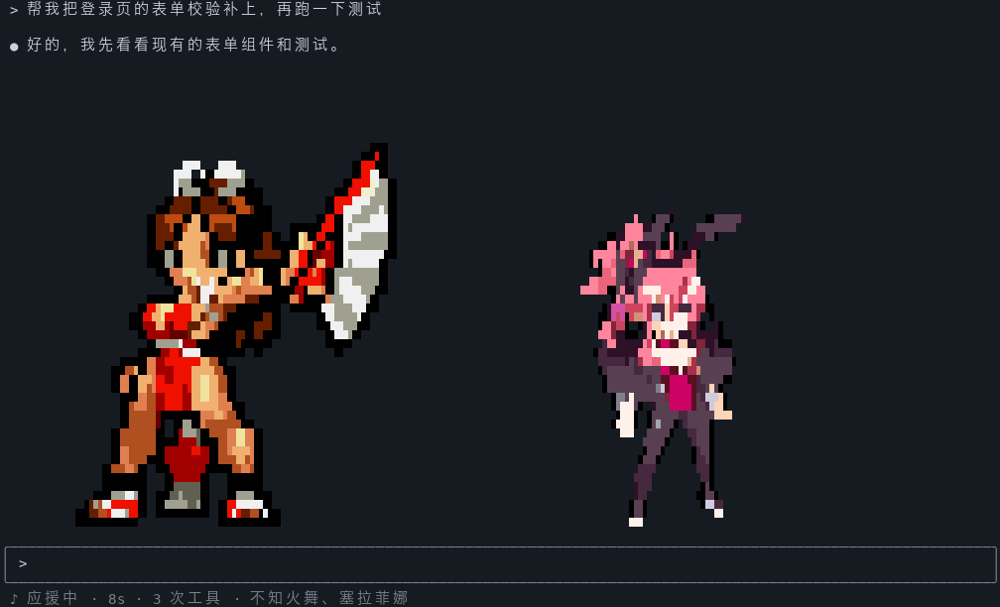
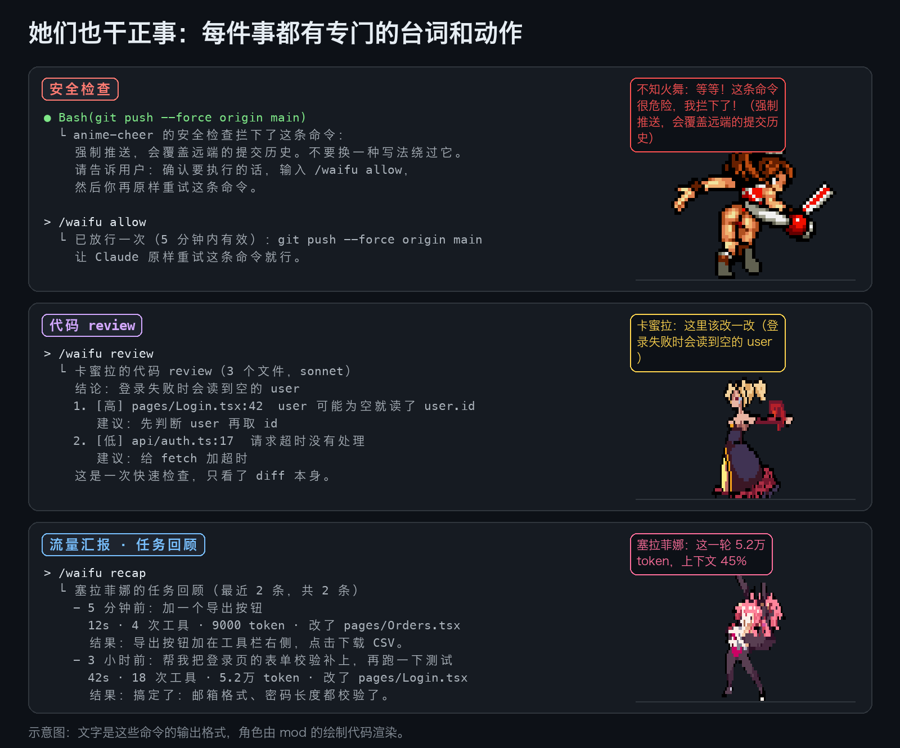
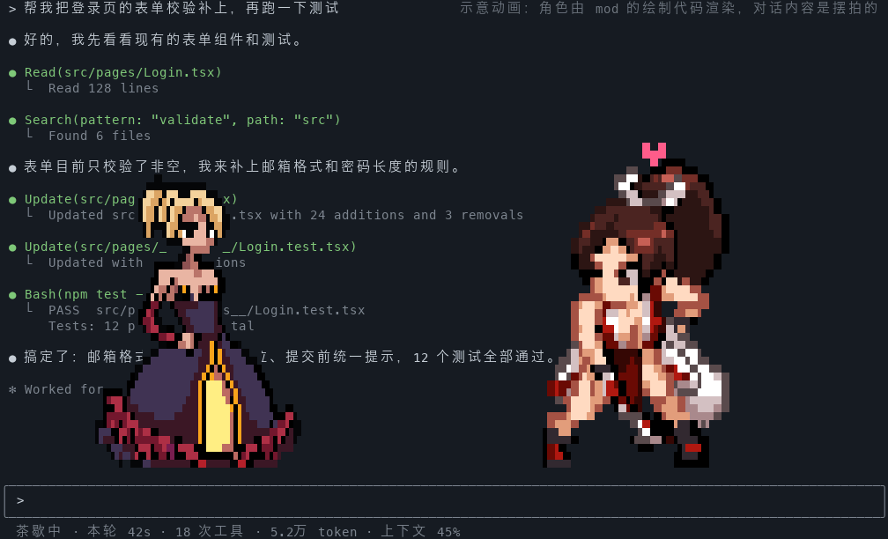
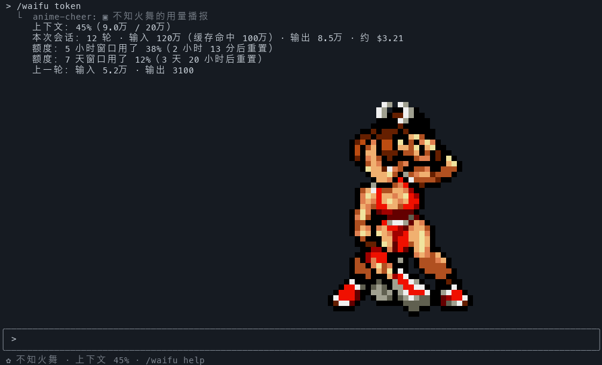

# cc-mod

Claude Code 的 mod 合集。目前有一个 mod 和一个最小示例：

- **anime-cheer（动漫应援团）**：像素风的动漫女孩在你的对话区里走来走去。Claude 干活时她们跳舞应援，干完活端茶捶背，用日语配音、带中文字幕。她们也干正事：播报 token 用量、拦下危险命令、扫描密钥、review 代码、回顾之前做过的任务。
- **examples/hello-mod**：三十来行的最小 mod，用来学怎么写。



仓库里的动图和示意图都不是录屏：角色由 mod 自己的绘制代码渲染，对话内容是摆拍的。

## 她们能做什么

| 功能 | 怎么触发 | 语音和动作 |
| --- | --- | --- |
| 流量汇报 | 干了活的一轮结束后，报这一轮新用的 token（不算缓存命中）和上下文占比，最多 45 秒报一次；`/waifu token` 看完整报告；上下文和额度窗口越过 50%、80%、95% 时主动提醒 | 做欢呼动作再播报 |
| 花费预算 | `/waifu budget 5` 设 5 美元的会话预算，用到 50%、80%、100% 时提醒 | 超预算时出招 |
| 安全检查 | 危险的 Bash 命令先拦下，你输入 `/waifu allow` 才放行一次；`git commit` 前看一遍要提交的内容里有没有密钥；Claude 写入的文件里出现密钥时提醒；`/waifu scan` 扫描当前改动 | 拦截时出招并喊“危险”，扫描干净时欢呼 |
| 代码 review | `/waifu review` 把工作区相对上次提交的改动交给模型审查，列出问题和修改建议 | 审查时来回踱步，通过欢呼，有问题出招 |
| 任务回顾 | 干了活的每一轮自动记一笔，按项目目录分开存；新会话开场提一句上次做到哪；`/waifu recap` 列出最近的任务 | 开场播报 |
| 结果播报 | 测试、推送命令跑完时说结果，构建只在失败时说；只有能确定结果时才开口。Claude 停下来等你时提醒；超过一分钟的一轮结束时弹系统通知（macOS） | 通过欢呼，失败出招 |
| 陪伴 | 跑任务时跳舞、走动，思考完和完成后端茶、捶背；每隔两到四分钟换人，台上一到两位；`/waifu <名字> <话>` 聊天；`/waifu fortune` 抽今日编码运势 | 每位角色有自己的声线和动作 |





## 安装

### 需要准备

- **Claude Code 2.1.287 或更新版本**，并且你的账号能用 function-hook mod。这是 Claude Code 的早期功能，由服务端的开关控制，接口也可能变。开关没打开时 mod 不会加载，`claude plugin test` 也跑不了。
- **全屏布局**：角色才能在对话区里走动。不是全屏时，她们提示一次之后就不出现、不出声；用 `/waifu pane` 可以把她们放进面板。
- **[bun](https://bun.sh)** 和 **ffmpeg**：导入角色素材时要用。
- **配音（可选，二选一）**：
  - 动漫声线：[VOICEVOX](https://voicevox.hiroshiba.jp/)，开着它的引擎即可
  - 普通日语女声：`pip install edge-tts`

只在 macOS 上用过。系统通知用的是 `osascript`，实时合成的台词（聊天、用量数字）用 `afplay` 播放，这两样在别的系统上不起作用。

### 第一步：下载角色素材

仓库里不带角色图片。请自己下载下面几张精灵图，放进同一个文件夹（默认是 `~/Downloads`），**文件名保持原样**：

| 角色 | 去哪下载 | 文件名 |
| --- | --- | --- |
| 不知火舞 | The Spriters Resource → Mobile → Metal Slug Defense → Units → Mai Shiranui | `Mobile - Metal Slug Defense - Units_ The King of Fighters - Mai Shiranui.png` |
| 小舞（Q 版） | The Spriters Resource → Mobile → Senran no Samurai Kingdom → Mai Shiranui | `Mobile - Senran no Samurai Kingdom (JPN) - Characters - The King of Fighters - Mai Shiranui.png` |
| 塞拉菲娜（兔女郎） | The Spriters Resource → Nintendo Switch → Disgaea 5 Complete → Seraphina (Bunny Girl) | `Nintendo Switch - Disgaea 5 Complete - Characters - Seraphina (Bunny Girl).png` |
| 卡蜜拉（吸血鬼伯爵夫人） | [CraftPix Free Vampire Pixel Art Sprite Sheets](https://free-game-assets.itch.io/free-vampire-pixel-art-sprite-sheets) | 解压后的 `Countess_Vampire/` 文件夹 |

缺哪张就少哪位。一张都没导入时，会由内置的手绘小人顶上（画得很粗糙，说中文）。

### 第二步：导入角色、生成配音

```sh
git clone https://github.com/a252937166/cc-mod.git
cd cc-mod/anime-cheer

sh tools/import-packs.sh ~/Downloads   # 把精灵图切帧、缩放，生成 packs/<角色>/pack.json
bun tools/make-voices.ts               # 录好所有预设台词：开着 VOICEVOX 就用动漫声线，否则用 edge-tts
```

### 第三步：加载 mod

```sh
claude --plugin-dir /path/to/cc-mod/anime-cheer
```

按 Claude Code 的 mod 文档，想每次启动都加载，可以在 `~/.claude/settings.json` 的 `env` 里写上绝对路径：

```json
{ "env": { "CLAUDE_CODE_PLUGIN_DIRS": "/path/to/cc-mod/anime-cheer" } }
```

## 命令

| 命令 | 作用 |
| --- | --- |
| `/waifu` | 显示或隐藏应援团。隐藏后她们不出声，也不调用模型；安全检查照常工作 |
| `/waifu help` | 查看全部命令 |
| `/waifu token` | 用量播报：上下文、额度窗口、会话花费、token |
| `/waifu today` | 今天聊了几轮、干了多久、用了多少 token、拦下几条命令 |
| `/waifu budget <美元>` | 设花费预算；`/waifu budget off` 取消 |
| `/waifu recap` | 这个项目目录里最近做过的任务 |
| `/waifu review [目录]` | 快速 review 仓库里还没提交的改动 |
| `/waifu scan [目录]` | 扫描还没提交的改动里的密钥和敏感文件 |
| `/waifu guard on` / `off` | 开关安全检查（默认开） |
| `/waifu allow` | 放行刚被拦下的那条命令一次 |
| `/waifu notify on` / `off` | 超过一分钟的一轮结束时弹系统通知（默认开） |
| `/waifu fortune` | 抽今日编码运势 |
| `/waifu list` / `call <名字>` / `bye <名字>` / `shuffle` | 看名单、叫人上台、请人退下、换一批 |
| `/waifu roam` / `pane` | 在对话区里走动，或待在面板里 |
| `/waifu mute` / `less` / `voice` | 配音全关、只留关键时刻、全开 |
| `/waifu ai on` / `off` | 开关 AI 即兴聊天 |
| `/waifu <名字> <话>` | 和某一位聊天，比如 `/waifu mai 今天好累` |

角色的名字可以用 `mai`、`maiq`、`bunny`、`countess`，也可以用中文名。原来的中文命令（`名单`、`日报`、`抽签` 等）还能用。

`review` 和 `scan` 看的是工作区相对上次提交的改动，git 还没跟踪的新文件也算。不写目录时用会话所在的仓库；会话目录本身不是仓库、下面正好有一个仓库时，就用那一个。



## 安全检查会拦什么

开着的时候（默认），下面这些 Bash 命令会被拦下，Claude 会收到原因并请你确认。你在 10 分钟内输入 `/waifu allow`，同一条命令就可以在 5 分钟内原样执行一次。

- `rm -r` 指向大范围的路径：根目录、主目录和它们下面的第一层（比如 `~/Desktop`、`/usr/local`）、当前目录、上级目录、`*`、`.git`，还有 `$变量/*` 这种变量为空就会删到根目录的写法
- `find <大范围目录> -delete` 或 `-exec rm`，并且没有 `-name` 之类的筛选条件
- `chmod -R`、`chown -R` 作用在根目录、主目录或它们下面的第一层
- `git push --force`（`--force-with-lease` 不拦）、`git reset --hard`、`git clean -f`、`git checkout .`、`git restore .`、`git checkout -f`、`git branch -D`
- 把下载的脚本直接执行：`curl … | sh`、`bash <(curl …)`、`sh -c "$(curl …)"`
- 通过数据库客户端执行的 `DROP`、`TRUNCATE TABLE`、不带 `WHERE` 的 `DELETE`，以及 `redis-cli FLUSHALL`
- `dd` 写磁盘设备、`mkfs`、`diskutil eraseDisk`
- `terraform destroy`、`kubectl delete` 命名空间或 `--all`、`docker system prune -a`、`gh repo delete`
- fork 炸弹
- `git commit`：要提交的内容里有密钥，或者有 `.env`、私钥这类敏感文件。同一条命令里 `git add` 将要暂存的内容也会看

这些命令包在 `bash -c "…"`、`eval`、`ssh 主机 "…"`、`$(…)` 里也认得。提交说明、`grep` 的搜索词这类引号里的文字，以及写文件用的 heredoc，一般不当成命令。

能认出的密钥有：私钥文件头、AWS 访问密钥、GitHub 令牌、Anthropic 和 OpenAI 风格的 API key、Slack 令牌、Google API key、JWT，以及写死在代码里的 `password = "…"` 这类赋值。

这是按规则匹配的提醒，不是沙箱：换一种写法的危险命令它可能认不出来，别把它当成唯一的防线。`/waifu allow` 只认你在输入框里亲手输入的。

## 花多少 token

- 预设台词、动画、安全检查、任务记录、流量汇报都在本机完成，不调用模型。
- `/waifu <话>` 聊天、每轮结束后的一句点评（最多 90 秒一次）、`/waifu recap` 在任务满 3 条时附的要点总结，各调用一次 haiku。`/waifu ai off` 可以把这三样都关掉。
- `/waifu review` 调用一次 sonnet（调不通时改用 haiku），把改动的 diff（最多约 6 万字符）发给它。锁文件、二进制文件和太大的文件不发。

## examples/hello-mod

最小的 mod：数工具调用、拦一条危险命令、一轮结束时弹提示。

```sh
claude plugin validate examples/hello-mod   # 检查清单，列出它挂了哪些钩子
claude --plugin-dir examples/hello-mod      # 带着它启动
```

## 测试

```sh
claude plugin test anime-cheer
```

`anime-cheer/tests` 里有三份测试：`cheer.test.ts` 用引擎自带的测试套件驱动整个 mod（30 个用例），`guard.test.ts` 和 `journal.test.ts` 测安全规则、任务记录和 review 的纯逻辑（12 个用例）。`claude plugin test` 同样需要 mod 的开关是开着的。

## 加你自己的角色

1. **导入素材**：用 `tools/import-pack.ts` 把精灵图切成帧。它支持三种素材排布：

   ```sh
   # 帧之间有透明空隙的普通精灵图
   bun tools/import-pack.ts <id> sheet.png --list
   # 每帧有底色框、框外是另一种底色（比如绿底粉框）
   bun tools/import-pack.ts <id> sheet.png --cells 00ff00 --key ff00ff --list
   # 每个动作一张横条图、帧大小固定（比如 128×128）
   bun tools/import-pack.ts <id> Idle.png Walk.png --grid 128x128 --list
   ```

   先加 `--list` 看帧编号，再用 `--anims` 指定每个动作用哪些帧，动作包括 `idle`、`walk`、`dance`、`cheer`、`attack`、`sleep`。常用参数：

   - `--scale`：缩放比例。像素画能不缩就不缩
   - `--sample mode`：缩小时保留主色，边缘更锐利
   - `--wide`：配合舞台的四分格渲染，横向采样加倍，基本都要加
   - `--facing left`：原图朝左的素材要加

2. **写人设和台词**：在 `hooks/troupe.ts` 里照现有角色加一项（名字、人设、声线、日语台词加中文字幕）。她值班时的台词写在 `hooks/duty.ts` 里，不写就用通用的中文台词。
3. **重新录音**：运行 `bun tools/make-voices.ts`。

想让人物清楚，优先找游戏里的像素精灵图（有分格的动作表）。高清立绘和插画缩到终端尺寸只会糊成马赛克。

## 一些实现细节

- **画法**：终端里画图用的是 mod 的 `Raster` 色块元素，每个字符格画 2×2 个像素（四分格字符）。人物要 18 到 20 行高才看得清。
- **颜色配额**：每种“前景色 + 背景色”组合第一次画之前要登记，登记有速率限制，用超了画面就会出现白杠和横条。所以每个角色导入时压到 20 种颜色以内；每个角色按三行一段切成几条色块，每条固定复用；舞台挂在对话区的一行上不乱动，跑任务时挂在“正在工作”的那一行。
- **挡字**：每条色块只占从最左到最右有颜色的那一段，色块以外的文字照常显示。
- **为什么不显示真图片**：按文档，真正的图片要终端支持 kitty 图片协议（kitty、Ghostty），其他终端只能用色块画。

## 版权和致谢

- 本仓库的**代码**以 MIT 协议开源。
- **角色素材**归各自的版权方所有（SNK、日本一、CraftPix 等），不包含在仓库里。请从上面的地方自己下载，只在本机使用，不要提交或分发。
- 动漫配音由 [VOICEVOX](https://voicevox.hiroshiba.jp/) 生成，声线有四国めたん、春日部つむぎ、九州そら、波音リツ。公开发布生成的音频时，请按 VOICEVOX 和各角色的使用条款署名，例如“VOICEVOX:四国めたん”。
